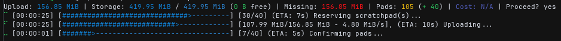

# Mutant: Decentralized P2P Mutable Key-Value Storage for Autonomi

<!-- Badges -->
[](https://github.com/Champii/Mutant/actions/workflows/ci.yml)
[](https://crates.io/crates/mutant-lib)
[](https://docs.rs/mutant-lib)
[](LICENSE)

> **Mutant** is a public/private mutable key-value store on the Autonomi decentralized storage network, featuring resumable uploads, local index caching, and a powerful async Rust API + CLI.

**Note:** No LLM was harmed in the making of this project.

[Autonomi](https://autonomi.com) is a P2P decentralized storage network, IT IS NOT A BLOCKCHAIN.


## Table of Contents
1. [Core Concepts](#core-concepts)
2. [Getting Started](#getting-started)
    1. [Prerequisites](#prerequisites)
    2. [Setup Rust Toolchain](#setup-rust-toolchain)
    3. [Setup `ant` Wallet](#setup-ant-wallet)
3. [Installation](#installation)
4. [Quick start demo](#quick-start-demo)
5. [Command-Line Interface (CLI)](#command-line-interface-cli)
    1. [CLI Usage Examples](#cli-usage-examples)
    2. [Basic Usage](#basic-usage)
        1. [Store/fetch private data](#storefetch-private-data)
        2. [Store/fetch public data](#storefetch-public-data)
        3. [Pipes and redirects](#pipes-and-redirects)
        4. [Stats and debug](#stats-and-debug)
    3. [Screenshots](#screenshots)
6. [Library Usage](#library-usage)
    1. [Fetching Public Data (Keyless Initialization)](#fetching-public-data-keyless-initialization)
7. [Development and Testing](#development-and-testing)
    1. [Local Testnet Management (`scripts/manage_local_testnet.sh`)](#local-testnet-management-scriptsmanage_local_testnetsh)
    2. [Running Integration Tests (`scripts/run_tests_with_env.sh`)](#running-integration-tests-scriptsrun_tests_with_envsh)
8. [Migration](#migration)
9. [Architecture Overview](#architecture-overview)
10. [Configuration](#configuration)
11. [License](#license)
12. [Contributing](#contributing)

## Core Concepts

*   **Decentralized:** Data is stored on the Autonomi decentralized storage network, not a centralized server. This means that no one can censor you, and you are in control of your own data, and it is accessible for anyone from anywhere. (If you wish so)
*   **Mutable:** Data can be updated and deleted, and the changes are propagated to all the nodes on the network.
*   **Key-Value Storage:** Offers a clean, asynchronous key-value interface (`get`, `put`, `rm`).
*   **Public/Private Uploads:** Store data publicly to share with others (no encryption) or store privately (encrypted with your private key).
*   **Resumable Uploads:** Automatic resume of interrupted uploads; pick up right where you left off.
*   **Fetch History:** Keep track of the public data you've fetched to re-fetch it later.
*   **Efficient Space Reuse:** Frees and reuses storage pads, minimizing storage costs.
*   **Local Cache Index:** Fast local lookups and seamless remote synchronization.
*   **Async-first Design:** Built on `tokio` for high-performance non-blocking operations.
*   **Dual Interface:** Use as a Rust library (`mutant-lib`) or via the `mutant` CLI.

## Getting Started

### Prerequisites

*   Rust Toolchain (latest stable recommended)
*   `ant` CLI configured with a wallet (see below)

### Setup Rust Toolchain

This will install rustup

```bash
$> curl --proto '=https' --tlsv1.2 -sSf https://sh.rustup.rs | sh
```

This will install the latest stable version of the Rust toolchain and cargo

```bash
$> rustup install nightly
```

### Setup `ant` Wallet

#### If you just want to fetch public data, you can skip this section.

Before using `mutant` to actually store data, you need to have an `ant` wallet configured for the target network (Mainnet by default, or Devnet if using the `--local` flag). If you don't have `ant` installed, you can get it using [antup](https://github.com/maidsafe/antup):

```bash
$> curl -sSf https://raw.githubusercontent.com/maidsafe/antup/main/install.sh | sh
```

This will install the `ant` CLI and configure it for the Mainnet.

```bash
$> antup client
```

Once `ant` is installed, if you haven't already, you can import your existing Ethereum/ANT wallet's private key using the `ant` CLI:

```bash
$> ant wallet import YOUR_PRIVATE_KEY_HERE
```

Replace `YOUR_PRIVATE_KEY_HERE` with your actual private key. `mutant` will automatically detect and use this wallet.

Alternatively, you can create a new empty wallet using `ant wallet create` and fund it with the necessary ANT or ETH later.

MutAnt will look for your ant wallets and ask you which one you want to use if you have multiple on the first run, then save your choice in `~/.config/mutant/config.json`.

## Installation

```bash
$> cargo install mutant
```

## Quick start demo

You can fetch a public data that I update in a loop at this address to try mutant yourself:

```bash
$> mutant get -p 9429076971abe17b485fd30dd3065d27fc36362ba164529e530722bdd693f6cb8904fc177bf657d29774eb42403ac980
# Output: Hello Autonomi ! Sat, 19 Apr 2025 18:06:41 +0000
```


## Command-Line Interface (CLI)

MutAnt includes the `mutant` command for convenient command-line access.

**CLI Usage Examples:**

```bash
$> mutant --help
```
```text
Distributed mutable key value storage over the Autonomi network

Usage: mutant [OPTIONS] <COMMAND>

Commands:
  put      Stores private or public data. Use `-p <name>` for public uploads (no encryption). Use `--force` to overwrite. Reads value from stdin if omitted
  get      Gets the value for a given key from the network and prints it to stdout
  rm       Deletes a key-value pair from the network
  ls       Lists all stored private keys and public uploads. Use -l for detailed view including public addresses
  stats    Get storage summary (allocator perspective)
  reset    Resets the master index to its initial empty state. Requires confirmation
  import   Imports a free scratchpad using its private key
  sync     Synchronize local index cache with remote storage. Use --push-force to overwrite remote index
  purge    Deletes all data associated with the current wallet. Requires confirmation
  reserve  Pre-allocates a number of empty scratchpads for future use
  help     Print this message or the help of the given subcommand(s)

Options:
  -l, --local    Use local network (Devnet) instead of Mainnet
  -q, --quiet    Suppress informational output (logs, progress bars)
  -h, --help     Print help
  -V, --version  Print version
```

**Basic Usage:**

#### Store/fetch private data

```bash
# Store a value directly
$> mutant put mykey "my value"

# Get a value and print to stdout
$> mutant get mykey
# Output: my value

# Update a value (you can use the shorter -f)
$> mutant put mykey "my new value" --force

# Remove a value
$> mutant rm mykey
```

#### Store/fetch public data

```bash
# Store data publicly (no encryption) under a name
$> mutant put -p my_key "some public content"
# Output: 1234567890abcdef1234567890abcdef1234567890abcdef1234567890abcdef

# Get your own public data by name
$> mutant get my_key
# Output: some public content

# Get public data by address
$> mutant get -p 1234567890abcdef1234567890abcdef1234567890abcdef1234567890abcdef
# Output: some public content

# You can update it all the same as the private data
$> mutant put -p my_key "some updated public content" --force
```

#### Pipes and redirects

```bash
# Store a value from stdin (e.g., piping a file)
$> cat data.txt | mutant put mykey2

$> mutant get mykey2 > fetched_data.txt
```

#### Stats and debug


```bash
# List stored keys
$> mutant ls
# mykey
# mykey2
# public_data @ 1234567890abcdef1234567890abcdef1234567890abcdef1234567890abcdef


# List keys with details (size, last modified)
$> mutant ls -l
# SIZE TYPE    MODIFIED     KEY/NAME
# 3 B  Private Apr 19 00:51 mykey
# 5 B  Private Apr 19 00:51 mykey2
# 11 B Public  Apr 19 00:51 public_data @ 1234567890abcdef1234567890abcdef1234567890abcdef1234567890abcdef
#
# --- Fetch History ---
# SIZE TYPE     FETCHED      ADDRESS
# 48 B Fetched  Apr 19 16:33 9429076971abe17b485fd30dd3065d27fc36362ba164529e530722bdd693f6cb8904fc177bf657d29774eb42403ac980

# Sync local index with remote storage
$> mutant sync

# Pre-allocate 5 scratchpads
$> mutant reserve 5

# View storage statistics
$> mutant stats
```

### Screenshots

```bash
$> cat big_file | mutant put my_big_file
```



```bash
$> mutant stats
```


## Library Usage

Add `mutant-lib` and its dependencies to your `Cargo.toml`:

```toml
[dependencies]
mutant-lib = "0.4.1" # Or the version you need
tokio = { version = "1", features = ["full"] }
```

**Library Example:**

This example demonstrates initializing the necessary components and performing basic store/fetch operations. It assumes you have an `ant` wallet setup.

```rust
use mutant_lib::{MutAnt, MutAntConfig, Error};

#[tokio::main]
async fn main() -> anyhow::Result<()> {
    // Replace with your actual private key (hex format, with or without 0x prefix)
    let private_key_hex = "0xYOUR_PRIVATE_KEY_HEX".to_string();

    let mut mutant = MutAnt::init(private_key_hex).await?;

    mutant.store("greeting", b"hello world").await?;

    let fetched_value = mutant.fetch("greeting").await?;

    println!("Fetched value: {}", String::from_utf8_lossy(&fetched_value));

    mutant.remove("greeting").await?;

    Ok(())
}
```

### Fetching Public Data (Keyless Initialization)

If your application only needs to retrieve publicly stored data (using `store_public`) and doesn't need to manage private data, you can initialize a lightweight `MutAnt` instance without a private key using `MutAnt::init_public()`:

```rust
use mutant_lib::{MutAnt, Error};
use mutant_lib::storage::ScratchpadAddress;
use anyhow::Result;

#[tokio::main]
async fn main() -> Result<()> {
    // Initialize a public fetcher instance (defaults to Mainnet)
    let public_fetcher = MutAnt::init_public().await?;

    // Assume you have the public address from elsewhere
    let address_hex = "..."; // Replace with actual public address hex
    let public_address = ScratchpadAddress::from_hex(address_hex)?;

    // Fetch the public data
    match public_fetcher.fetch_public(public_address, None).await {
        Ok(data) => println!("Fetched public data: {} bytes", data.len()),
        Err(e) => eprintln!("Failed to fetch public data: {}", e),
    }

    Ok(())
}

This keyless instance is optimized for fetching public data and cannot perform operations requiring a private key (like `