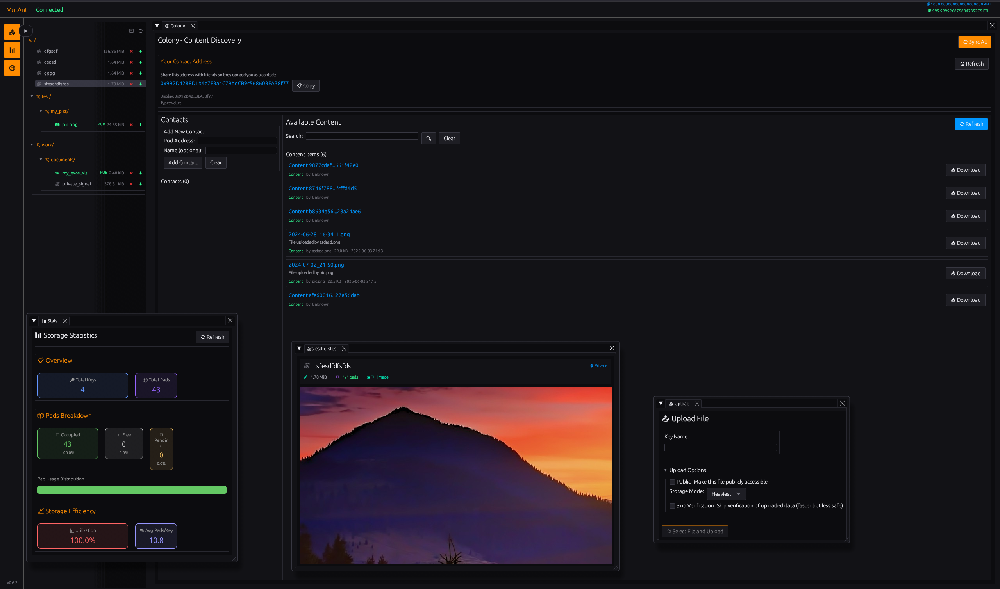

# Mutant: Decentralized P2P Mutable Key-Value Storage for [Autonomi](https://autonomi.com)

<!-- Badges -->
[](https://github.com/Champii/Mutant/actions/workflows/ci.yml)
[](https://crates.io/crates/mutant-lib)
[](https://docs.rs/mutant-lib)
[](LICENSE)

> **Mutant** is a decentralized P2P mutable key-value storage system built on the Autonomi network, featuring chunking, encryption, resumable uploads, pad recycling, daemon architecture, and background task management with a powerful async Rust API + CLI. Self-Hosted by default.

<p align="center">
  
</p>

<p align="center">
  
</p>


**Note:** No LLMs were harmed in the making of this project.

## Table of Contents
1. [Core Concepts](#core-concepts)
2. [Installation](#installation)
3. [Quick start demo](#quick-start-demo)
4. [Command-Line Interface (CLI)](#command-line-interface-cli)
    1. [CLI Usage Examples](#cli-usage-examples)
    2. [Basic Usage](#basic-usage)
        1. [Store/fetch private data](#storefetch-private-data)
        2. [Store/fetch public data](#storefetch-public-data)
        3. [Pipes and redirects](#pipes-and-redirects)
        4. [Stats and debug](#stats-and-debug)
    3. [Screenshots](#screenshots)
5. [Library Usage](#library-usage)
    1. [Fetching Public Data (Keyless Initialization)](#fetching-public-data-keyless-initialization)
6. [Development and Testing](#development-and-testing)
    1. [Local Testnet Management (`scripts/manage_local_testnet.sh`)](#local-testnet-management-scriptsmanage_local_testnetsh)
    2. [Running Integration Tests (`scripts/run_tests_with_env.sh`)](#running-integration-tests-scriptsrun_tests_with_envsh)
7. [Migration](#migration)
8. [Architecture Overview](#architecture-overview)
9. [Configuration](#configuration)
10. [License](#license)
11. [Contributing](#contributing)

## Core Concepts

*   **Decentralized:** Data is stored on the Autonomi decentralized storage network, not a centralized server. This means that no one can censor you, and you are in control of your own data, and it is accessible for anyone from anywhere. (If you wish so)
*   **Mutable:** Data can be updated and deleted, and the changes are persisted on the network.
*   **Key-Value Storage:** Offers a clean, asynchronous key-value interface (`get`, `put`, `rm`).
*   **Public/Private Uploads:** Store data publicly to share with others (no encryption) or store privately (encrypted with your private key).
*   **Resumable Uploads:** Automatic resume of interrupted uploads; pick up right where you left off.
*   **Configurable Upload Size:** Split the data into smaller or bigger chunks to optimize the upload speed and storage costs (default is 2MiB).
*   **Fetch History:** Keep track of the public data you've fetched to re-fetch it later.
*   **Efficient Space Reuse:** Frees and reuses storage pads, minimizing storage costs.
*   **Local Cache Index:** Fast local lookups and seamless remote synchronization.
*   **Sync:** Synchronize your local index with the remote storage.
*   **Recycling Bad Pads:** Automatically recycle bad pads to stay performant.
*   **Health Check:** Perform a health check on keys and reupload pads that give an error.
*   **Background Processing:** Run operations in the background with task management.
*   **Daemon Architecture:** Persistent daemon process handles network connections and operations.
*   **Task Management:** Monitor, query, and control background tasks.
*   **Async-first Design:** Built on `tokio` for high-performance non-blocking operations.
*   **Dual Interface:** Use as a Rust library (`mutant-lib`) or via the `mutant` CLI.
*   **Web Interface**
       - Customizable windowed workspace 
       - Image viewer
       - Text/Code viewer/editor
       - Universal video format support with real-time transcoding and streaming with ffmpeg

## Installation

This is the all-in-one installation script that will install all dependencies, build the project, then run the daemon and the web interface.

```bash
curl https://raw.githubusercontent.com/Champii/Mutant/refs/heads/master/install.sh | bash
```

You will need to provide an Ethereum private key as well as an mnemonic phrase for the colony.  
While this script propose to generate both, this feature is currently broken. 

You need to generate both from [https://devtoolcafe.com/tools/bip39-generator](https://devtoolcafe.com/tools/bip39-generator) and give them to the script when asked.


## Quick start demo

You can fetch the daily meme of the day with the following command:

```bash
$> mutant get -p a420224971527d61ce6ee21d850a07c243498c95808697e8fac23f461545656933016697d10b805c0fa26b50eb3532b2 daily_meme.jpg
```

## Command-Line Interface (CLI)


<p align="center">
  
</p>


MutAnt includes the `mutant` command for convenient command-line access. When run without arguments, it defaults to listing your stored keys.

**CLI Usage Examples:**

```bash
$> mutant --help
```

```text
Usage: mutant [OPTIONS] [COMMAND]

Commands:
  put           Store a value associated with a key
  get           Retrieve a value associated with a key
  rm            Remove a key-value pair
  ls            List stored keys
  stats         Show storage statistics
  tasks         Manage background tasks
  daemon        Manage the daemon
  sync          Synchronize local index cache with remote storage
  purge         Perform a get check on scratchpads that should have been created but failed at some point. Removes the pads that are not found.
  import        Import scratchpad private key from a file
  export        Export all scratchpad private key to a file
  health-check  Perform a health check on scratchpads that should have been created but cannot be retrieved. Recycles the pads that are not found.
  help          Print this message or the help of the given subcommand(s)

Options:
  -q, --quiet    Suppress progress bar output
  -h, --help     Print help
  -V, --version  Print version
```

**Basic Usage:**

#### Store/fetch private data

```bash
# Store a the file `data.txt` under the name `mykey`
$> mutant put mykey data.txt

# Get a value and save to a file
$> mutant get mykey fetched_data.txt

# Run operations in the background
$> mutant put my_file large_file.zip --background

# Remove a value
$> mutant rm mykey
```

#### Store/fetch public data

```bash
# Store data publicly (no encryption) under a name
$> mutant put -p my_key my_file.ext
1234567890abcdef1234567890abcdef1234567890abcdef1234567890abcdef

# Get your own public data by name
$> mutant get my_key output.txt

# Get public data by address
$> mutant get -p 1234567890abcdef1234567890abcdef1234567890abcdef1234567890abcdef output.txt

# You can update public data by using the same key
$> mutant put -p my_key my_updated_file.ext
```

#### Daemon and task management

```bash
# Start the daemon (happens automatically when needed)
$> mutant daemon start

# Check daemon status
$> mutant daemon status

# List background tasks
$> mutant tasks list

# Get details of a specific task
$> mutant tasks get <task_id>

# Stop a running task
$> mutant tasks stop <task_id>
```

#### Stats and management

```bash
# List stored keys
$> mutant ls
 Key                   Pads       Size Status       Address/Info
----------------------------------------------------------------------
 dwarf                  265   1.03 GiB Ready        Private
 nothing_here             2   3.28 KiB Ready        Public: ac09242b5c5658dd313e37b08cba4810346bc8ce75f32d9330b20f142c941fa47a396077e91acfb990edab5430e3245
 zorglub                 10 100.00 KiB 61% (6/10)   Private

# List stored keys with fetch history
$> mutant ls --history

# Sync local index with remote storage
$> mutant sync

# View storage statistics
$> mutant stats
Storage Statistics:
-------------------
Total Keys: 2
Total Pads Managed:    270
  Occupied (Private):  267
  Free Pads:           3
  Pending Verify Pads: 0

# Perform health check on a specific key with recycling enabled
$> mutant health-check mykey --recycle
```


## Library Usage

Add `mutant-lib` and its dependencies to your `Cargo.toml`:

```toml
[dependencies]
mutant-lib = "0.6.2" # Or the version you need
tokio = { version = "1", features = ["full"] }
```

**Library Example:**

This example demonstrates initializing the necessary components and performing basic private store/fetch operations. It assumes you have an `ant` wallet setup.

```rust
use mutant_lib::{MutAnt, MutAntConfig, Error};

#[tokio::main]
async fn main() -> anyhow::Result<()> {
    // Replace with your actual private key (hex format, with or without 0x prefix)
    let private_key_hex = "0xYOUR_PRIVATE_KEY_HEX";

    let mut mutant = MutAnt::init(private_key_hex).await?;

    mutant.put("greeting", b"hello world", StorageMode::Medium, false).await?;

    let fetched_value = mutant.get("greeting").await?;
    println!("Fetched value: {}", String::from_utf8_lossy(&fetched_value));

    mutant.rm("greeting").await?;

    Ok(())
}
```

### Fetching Public Data (Keyless Initialization)

If your application only needs to retrieve publicly stored data (using `store_public`) and doesn't need to manage private data, you can initialize a lightweight `MutAnt` instance without a private key using `MutAnt::init_public()`:

```rust
use mutant_lib::{MutAnt, Error};
use mutant_lib::storage::ScratchpadAddress;
use anyhow::Result;

#[tokio::main]
async fn main() -> Result<()> {
    // Initialize a public fetcher instance (defaults to Mainnet)
    let public_fetcher = MutAnt::init_public().await?;

    // Assume you have the public address from elsewhere
    let address_hex = "..."; // Replace with actual public address hex
    let public_address = ScratchpadAddress::from_hex(address_hex)?;

    // Fetch the public data
    match public_fetcher.get_public(public_address).await {
        Ok(data) => println!("Fetched public data: {} bytes", data.len()),
        Err(e) => eprintln!("Failed to fetch public data: {}", e),
    }

    Ok(())
}

This keyless instance is optimized for fetching public data and cannot perform operations requiring a private key (like `put`, `rm`, `ls`, etc).

### Using the Daemon and Client

For most applications, it's recommended to use the daemon architecture:

```rust
use mutant_client::MutantClient;
use anyhow::Result;

#[tokio::main]
async fn main() -> Result<()> {
    // Connect to the daemon (must be running)
    let mut client = MutantClient::new();
    client.connect("ws://localhost:3001/ws").await?;

    // Start a put operation in the background
    let (start_task, progress_rx) = client.put(
        "my_key",
        "path/to/file.txt",
        mutant_protocol::StorageMode::Medium,
        false, // not public
        false, // verify
    ).await?;

    // Monitor progress (optional)
    tokio::spawn(async move {
        while let Ok(progress) = progress_rx.recv().await {
            println!("Progress: {:?}", progress);
        }
    });

    // Wait for the task to complete
    let result = start_task.await?;
    println!("Task completed: {:?}", result);

    Ok(())
}
```

# Donate

If you find this project useful, you can donate to support its development. <3

ETH/ANT `0x3376C33FdC0c885cef483690ffDd1e0Ff0Eb026c`
