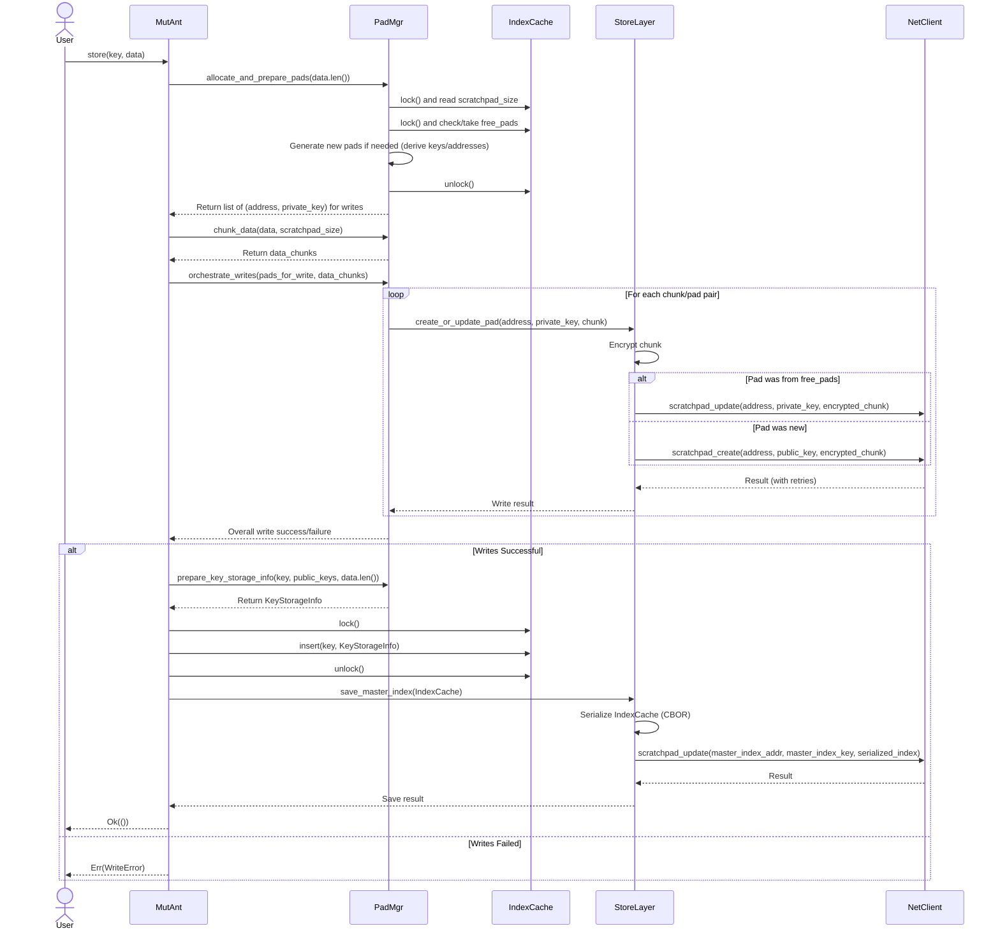
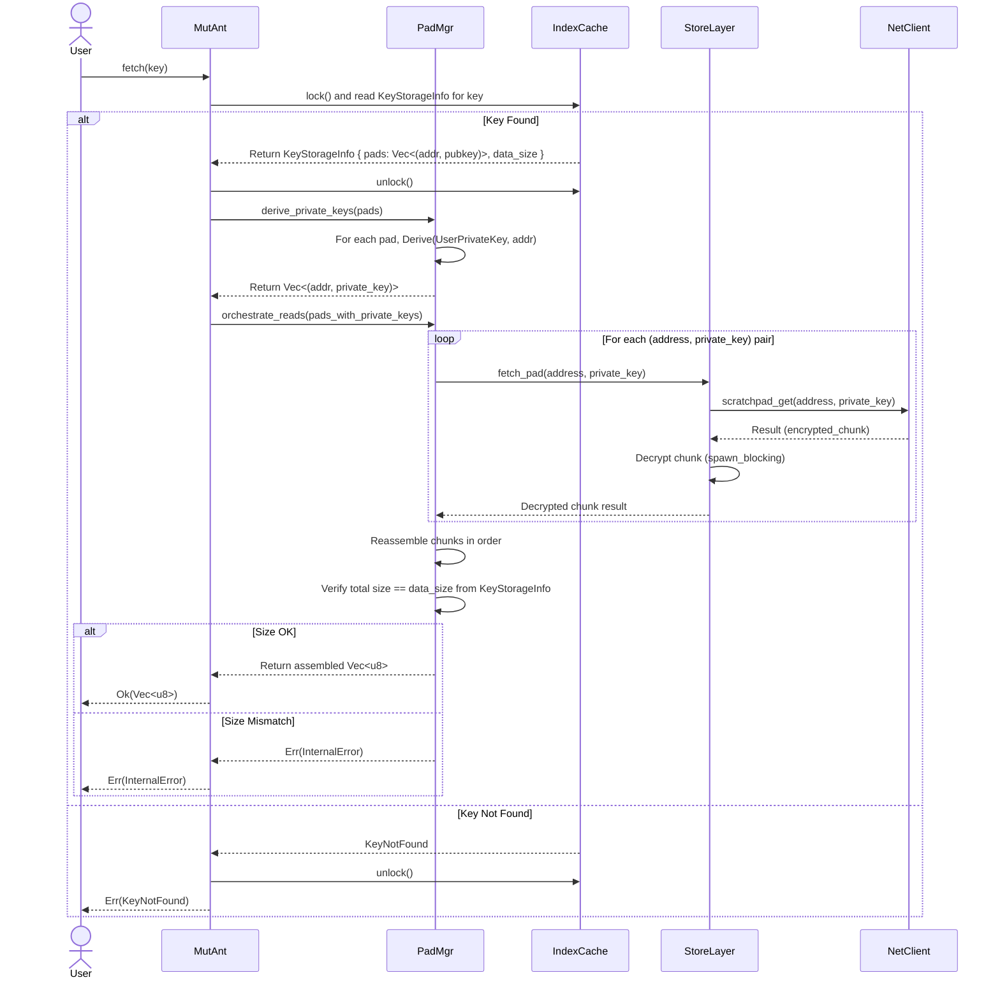
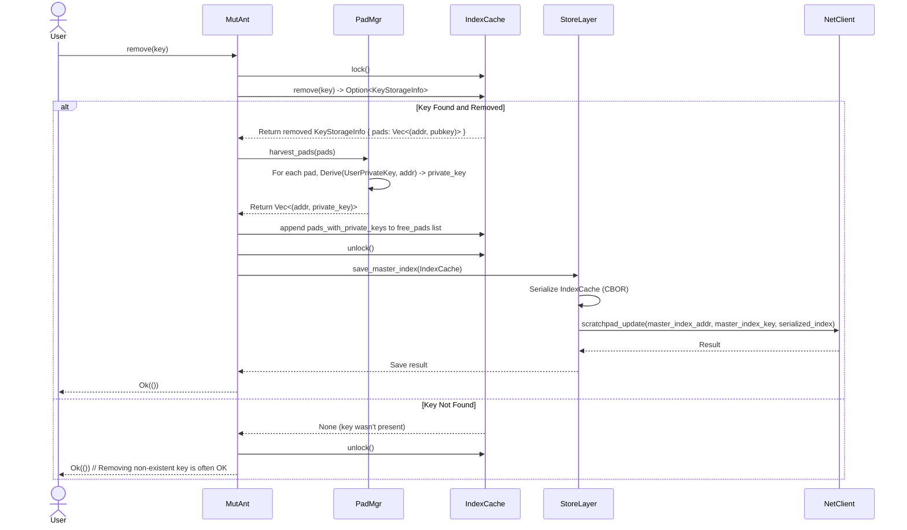

# Internals: Operation Flows

This document outlines the step-by-step internal process for the core `MutAnt` operations: `store`, `fetch`, and `remove`. It shows how the API layer, Pad Manager, Storage Layer, and data structures interact.

**Legend:**

*   `MutAnt`: The public API instance.
*   `PadMgr`: The internal Pad Manager / Pad Lifecycle component.
*   `StoreLayer`: The internal Storage Layer component.
*   `IndexCache`: The `Arc<Mutex<MasterIndexStorage>>` holding the in-memory index.
*   `NetClient`: The `autonomi::Client` instance.

## 1. Store Flow (`MutAnt::store`)

**Goal:** Store `data` under `key`.

**Steps:**

1.  **User Call:** `MutAnt::store(key, data)` is called.
2.  **Pad Allocation (PadMgr):**
    *   Calculates the number of pads needed.
    *   Locks `IndexCache`, checks `scratchpad_size`.
    *   Locks `IndexCache`, tries to acquire pads from `free_pads` (obtaining their private keys).
    *   Generates any additional new pads required (creating new private/public key pairs and addresses).
    *   Unlocks `IndexCache`.
    *   Returns the list of `(address, private_key)` tuples needed for writing.
3.  **Chunking (PadMgr):** Splits `data` into chunks based on `scratchpad_size`.
4.  **Concurrent Writes (PadMgr -> StoreLayer -> NetClient):**
    *   Iterates through chunks and the allocated pad list.
    *   For each pair, calls `StoreLayer::create_or_update_pad`.
    *   `StoreLayer` encrypts the chunk using the provided private key.
    *   `StoreLayer` calls `NetClient::scratchpad_create` (for new pads, using the public key) or `NetClient::scratchpad_update` (for reused pads, using the private key).
    *   Network results (including retries) propagate back.
5.  **Index Update (MutAnt -> IndexCache):**
    *   If all writes succeed, `MutAnt` asks `PadMgr` to format the `KeyStorageInfo` (using the *public* keys of the pads).
    *   `MutAnt` locks `IndexCache` and inserts the new `(key, KeyStorageInfo)` mapping.
    *   `MutAnt` unlocks `IndexCache`.
6.  **Persist Index (MutAnt -> StoreLayer -> NetClient):**
    *   `MutAnt` calls `StoreLayer::save_master_index`.
    *   `StoreLayer` serializes the current `IndexCache` content to CBOR.
    *   `StoreLayer` calls `NetClient::scratchpad_update` to save the serialized index to the Master Index pad.
7.  **Return:** `MutAnt` returns `Ok(())` or an appropriate `Error` to the user.

## 2. Fetch Flow (`MutAnt::fetch`)

**Goal:** Retrieve the data associated with `key`.

**Steps:**

1.  **User Call:** `MutAnt::fetch(key)` is called.
2.  **Index Lookup (MutAnt -> IndexCache):**
    *   `MutAnt` locks `IndexCache`.
    *   Looks up `key` in the `index` map.
    *   If found, retrieves the `KeyStorageInfo` (containing the list of `(address, public_key)` tuples and `data_size`).
    *   If not found, unlocks and returns `Error::KeyNotFound`.
    *   Unlocks `IndexCache`.
3.  **Derive Private Keys (MutAnt -> PadMgr):**
    *   `MutAnt` passes the list of `(address, public_key)` tuples to `PadMgr`.
    *   `PadMgr` iterates through the list, deterministically deriving the *private key* for each `address` using the main user private key.
    *   Returns the list of `(address, private_key)` tuples.
4.  **Concurrent Reads (PadMgr -> StoreLayer -> NetClient):**
    *   `PadMgr` iterates through the `(address, private_key)` list.
    *   For each pair, calls `StoreLayer::fetch_pad`.
    *   `StoreLayer` calls `NetClient::scratchpad_get` using the address and private key.
    *   `StoreLayer` receives the encrypted chunk.
    *   `StoreLayer` decrypts the chunk (potentially offloading to `spawn_blocking`).
    *   Decrypted chunks are returned to `PadMgr`.
5.  **Reassembly & Verification (PadMgr):**
    *   `PadMgr` collects all decrypted chunks.
    *   Reassembles them in the original order (based on the `KeyStorageInfo.pads` list).
    *   Compares the size of the reassembled data with `KeyStorageInfo.data_size`.
6.  **Return:**
    *   If size matches, `PadMgr` returns the `Vec<u8>` to `MutAnt`, which returns `Ok(data)` to the user.
    *   If size mismatches, returns `Error::InternalError`.

## 3. Remove Flow (`MutAnt::remove`)

**Goal:** Remove `key` and recycle its pads.

**Steps:**

1.  **User Call:** `MutAnt::remove(key)` is called.
2.  **Index Update (MutAnt -> IndexCache):**
    *   `MutAnt` locks `IndexCache`.
    *   Calls `remove(key)` on the `index` map. This returns the `KeyStorageInfo` if the key existed.
3.  **Pad Harvesting (MutAnt -> PadMgr):**
    *   If a `KeyStorageInfo` was returned (key existed):
        *   `MutAnt` passes the `pads` list (`Vec<(address, public_key)>`) to `PadMgr`.
        *   `PadMgr` derives the *private key* for each address.
        *   `PadMgr` returns the list of `(address, private_key)` tuples.
        *   `MutAnt` appends this list to the `free_pads` vector within the locked `IndexCache`.
4.  **Unlock Index:** `MutAnt` unlocks `IndexCache`.
5.  **Persist Index (MutAnt -> StoreLayer -> NetClient):**
    *   If the key existed and pads were harvested (or even if the key didn't exist, saving is often harmless), `MutAnt` calls `StoreLayer::save_master_index`.
    *   `StoreLayer` serializes the potentially updated `IndexCache` content to CBOR.
    *   `StoreLayer` calls `NetClient::scratchpad_update` to save the index.
6.  **Return:** `MutAnt` returns `Ok(())` to the user (typically, removing a non-existent key is not an error). 