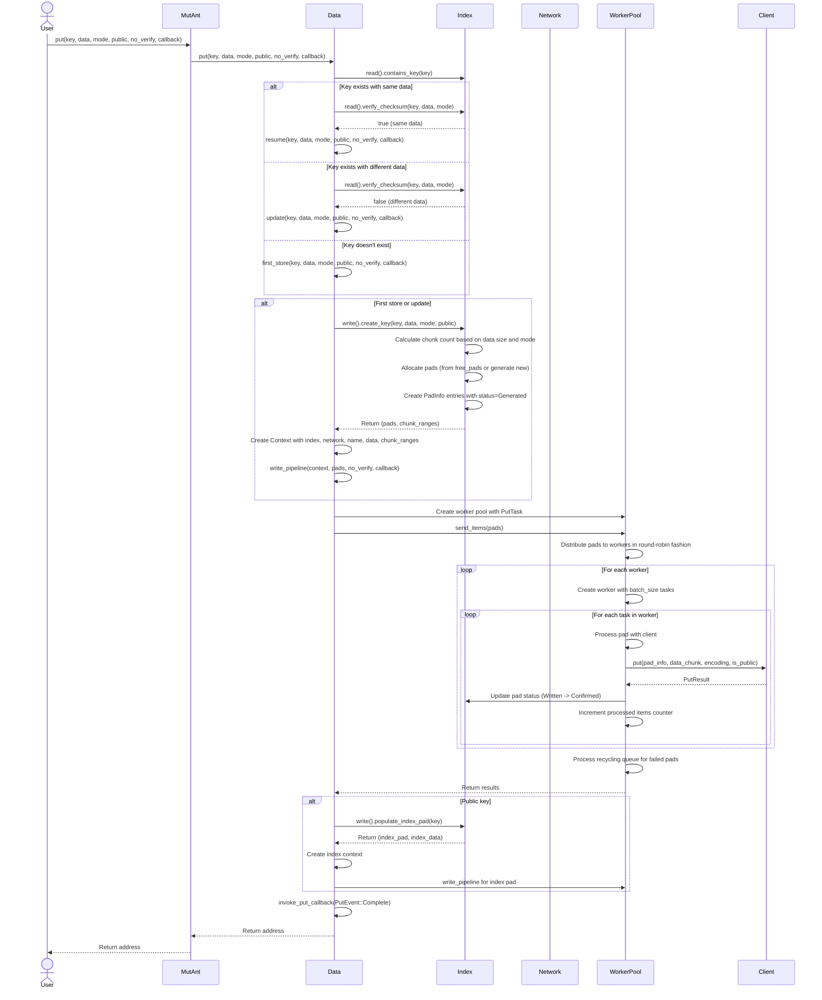
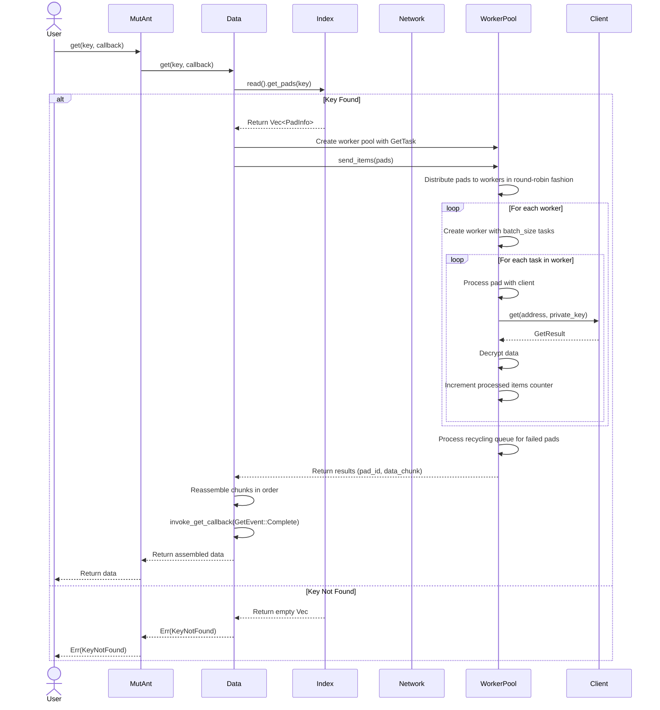
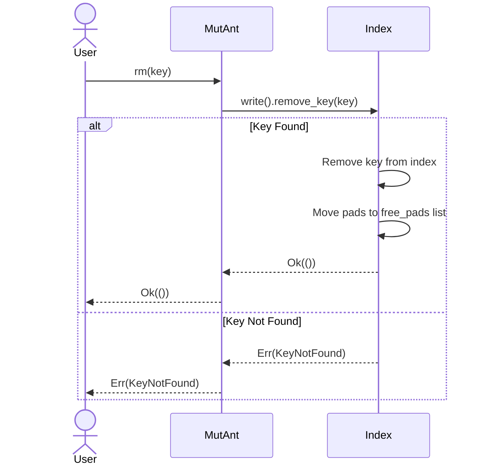
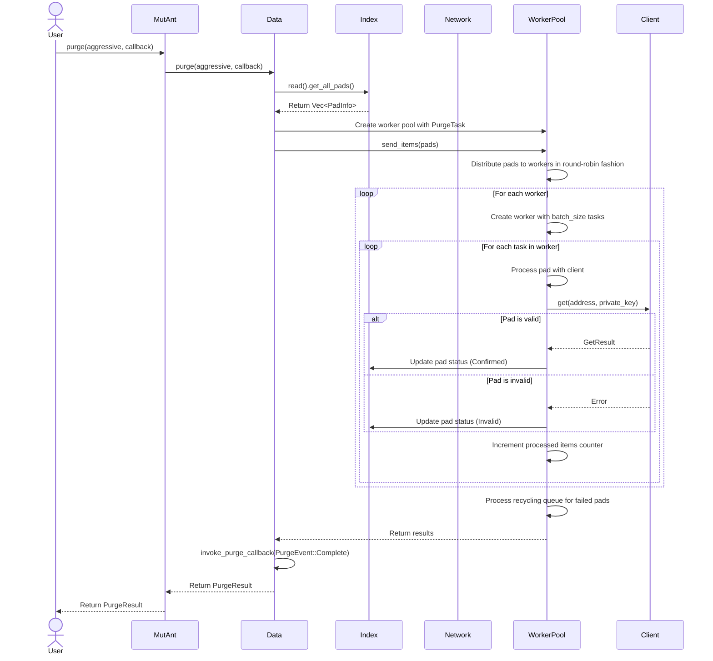
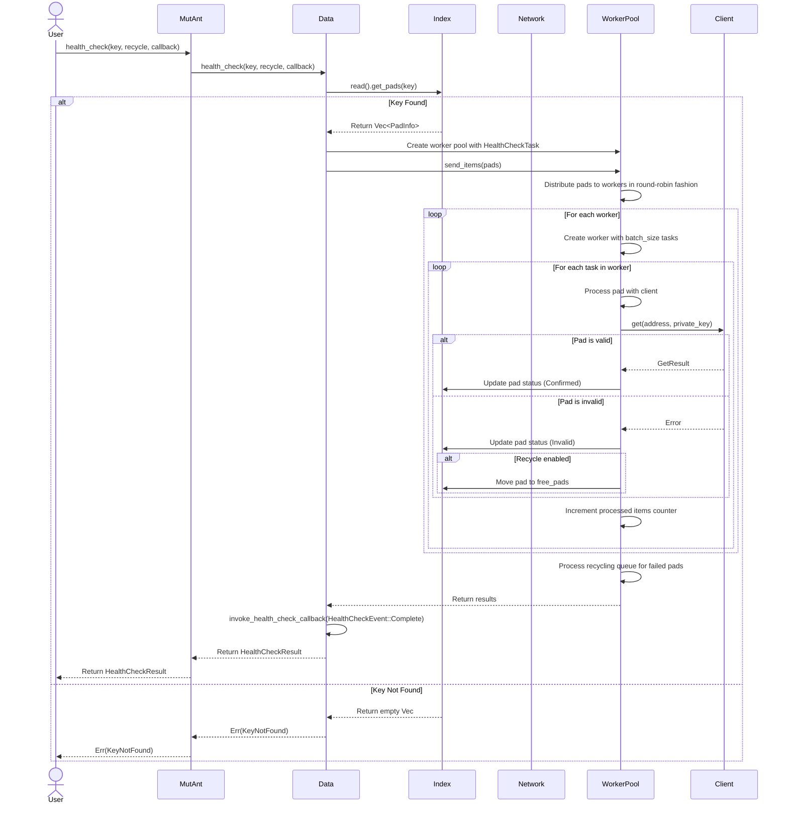

# Internals: Operation Flows

This document outlines the step-by-step internal process for the core `MutAnt` operations: `put`, `get`, and `rm`. It shows how the API layer, worker pool, network layer, and data structures interact.

**Legend:**

* `MutAnt`: The public API instance
* `Data`: The central coordinator for data operations
* `Index`: The `Arc<RwLock<MasterIndex>>` holding the in-memory index
* `Network`: The network adapter for Autonomi operations
* `WorkerPool`: The pool of workers that process operations concurrently
* `Client`: The `autonomi::Client` instance

## 1. Put Flow (`MutAnt::put`)

**Goal:** Store `data` under `key`.

**Steps:**

1. **User Call:** `MutAnt::put(key, data, mode, public, no_verify, callback)` is called.
2. **Key Check:**
   * Check if the key already exists in the index.
   * If it exists with the same data (verified by checksum), resume the operation.
   * If it exists with different data, update the key.
   * If it doesn't exist, create a new key.
3. **Key Creation:**
   * Calculate chunk count based on data size and storage mode.
   * Allocate pads from free_pads or generate new ones.
   * Create PadInfo entries with status=Generated.
   * Return the pads and chunk ranges.
4. **Worker Pool Setup:**
   * Create a Context with all necessary information.
   * Create a worker pool with the appropriate task (PutTask).
   * Distribute pads to workers in round-robin fashion.
5. **Concurrent Processing:**
   * Each worker processes its assigned pads.
   * Each worker has a batch of concurrent tasks (default: 10).
   * Each task writes a pad to the network.
   * Update pad status as operations complete.
   * Failed operations are sent to the recycling queue.
6. **Public Index (if applicable):**
   * For public keys, create and write a special index pad.
   * This pad contains metadata about the data pads.
   * The index pad address is used as the public address for the key.
7. **Completion:**
   * Invoke the completion callback.
   * Return the address of the first pad (or index pad for public keys).

## 2. Get Flow (`MutAnt::get`)

**Goal:** Retrieve the data associated with `key`.

**Steps:**

1. **User Call:** `MutAnt::get(key, callback)` is called.
2. **Index Lookup:**
   * Look up the key in the index to get the associated pads.
   * If the key is not found, return an error.
3. **Worker Pool Setup:**
   * Create a worker pool with the appropriate task (GetTask).
   * Distribute pads to workers in round-robin fashion.
4. **Concurrent Processing:**
   * Each worker processes its assigned pads.
   * Each worker has a batch of concurrent tasks (default: 10).
   * Each task fetches a pad from the network and decrypts it.
   * Failed operations are sent to the recycling queue.
5. **Reassembly:**
   * Collect all decrypted chunks.
   * Reassemble them in the correct order based on pad IDs.
6. **Completion:**
   * Invoke the completion callback.
   * Return the assembled data.

## 3. Remove Flow (`MutAnt::rm`)

**Goal:** Remove `key` and recycle its pads.

**Steps:**

1. **User Call:** `MutAnt::rm(key)` is called.
2. **Index Update:**
   * Acquire a write lock on the index.
   * Remove the key from the index.
   * Move the associated pads to the free_pads list.
   * Release the lock.
3. **Return:**
   * Return success or an error if the key was not found.

## 4. Purge Flow (`MutAnt::purge`)

**Goal:** Verify and clean up invalid pads.

**Steps:**

1. **User Call:** `MutAnt::purge(aggressive, callback)` is called.
2. **Pad Collection:**
   * Get all pads from the index.
   * If aggressive is true, include all pads; otherwise, only include pads that need verification.
3. **Worker Pool Setup:**
   * Create a worker pool with the appropriate task (PurgeTask).
   * Distribute pads to workers in round-robin fashion.
4. **Concurrent Processing:**
   * Each worker processes its assigned pads.
   * Each worker has a batch of concurrent tasks (default: 10).
   * Each task verifies a pad by attempting to fetch it from the network.
   * Update pad status based on the result (Confirmed or Invalid).
   * Failed operations are sent to the recycling queue.
5. **Completion:**
   * Invoke the completion callback.
   * Return the purge result with statistics.

## 5. Health Check Flow (`MutAnt::health_check`)

**Goal:** Verify the integrity of a specific key.

**Steps:**

1. **User Call:** `MutAnt::health_check(key, recycle, callback)` is called.
2. **Pad Collection:**
   * Get all pads for the specified key.
   * If the key is not found, return an error.
3. **Worker Pool Setup:**
   * Create a worker pool with the appropriate task (HealthCheckTask).
   * Distribute pads to workers in round-robin fashion.
4. **Concurrent Processing:**
   * Each worker processes its assigned pads.
   * Each worker has a batch of concurrent tasks (default: 10).
   * Each task verifies a pad by attempting to fetch it from the network.
   * Update pad status based on the result (Confirmed or Invalid).
   * If recycle is enabled, move invalid pads to the free_pads list.
   * Failed operations are sent to the recycling queue.
5. **Completion:**
   * Invoke the completion callback.
   * Return the health check result with statistics.